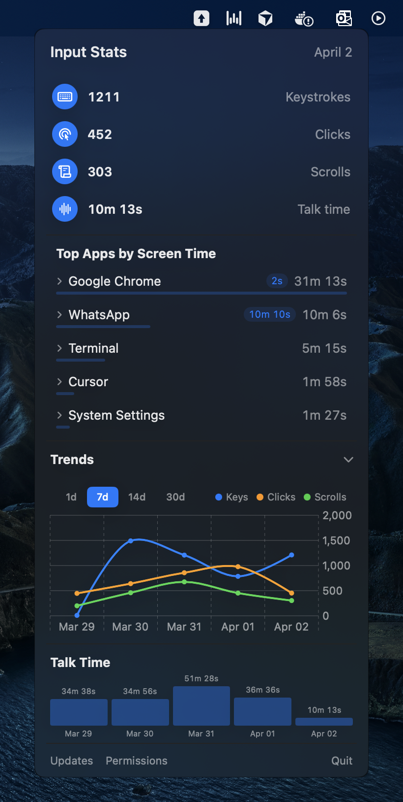
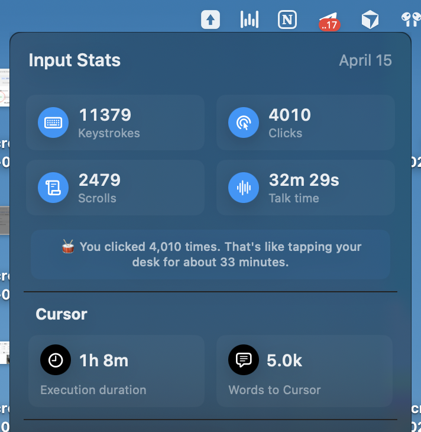
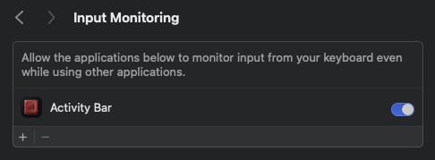

<div align="center">
  
  <h3 align="center">Activity Bar</h3>
  <p align="center">
    Track how you work, and how AI works for you.
    <br />
    A macOS menu bar app that tracks your <b>keystrokes</b>, <b>clicks</b>, <b>scrolling</b>, <b>voice input</b>,
    <br />
    and <b>coding tool activity</b>. See how much time <i>Claude Code</i>, <i>Cursor</i> and <i>Codex</i> spend working for you.
    <br />
    <br />
    <a href="https://github.com/SuveenE/activity-bar/releases/latest">
      
    </a>
    <a href="LICENSE">
      
    </a>
    
  </p>
  <br />
  <p>
    
    &nbsp;
    
  </p>
  <p><em>No telemetry, everything stays local.</em></p>
</div>

## Install

1. Download `ActivityBar.dmg` from the [latest GitHub Release](https://github.com/SuveenE/activity-bar/releases/latest)
2. Open the DMG and drag **Activity Bar** to Applications
3. Launch **Activity Bar** and grant **Input Monitoring** when prompted

   

## Features

- **Menu bar widget** with a floating panel for quick-glance daily stats
- **Per-app breakdown** of keystrokes, clicks, scrolls, screen time, and talk time
- **Talk time detection** using CoreAudio microphone activity monitoring
- **Coding tool stats** tracking execution duration and words sent via hooks (Claude Code, Cursor)
- **Trend charts** with interactive 1d / 7d / 14d / 30d range picker
- **Daily persistence** with a rolling 7-day history

## Data Storage

All data is stored locally in `UserDefaults` — nothing is sent to any server. The plist file lives at:

```
~/Library/Preferences/com.suveene.MacInputStats.plist
```

## License

MIT License. See [LICENSE](LICENSE) for details.
